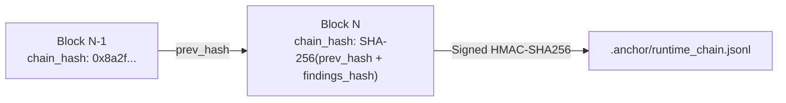

# System Architectural Reference

This reference document details the internal components, data schemas, class bindings, and execution details of the **`anchor`** governance core.

---

## 01. Codebase Component Registry

The `anchor` package is organized into modular layers handling static AST analysis, runtime proxy hookups, WASM containment, and compliance reports.

```text
anchor/
├── core/
│   ├── engine.py           # Evaluates rules against AST nodes & regex patterns
│   ├── loader.py           # Loads federated rulesets (domains, frameworks, regulators)
│   ├── policy_loader.py    # Merges policy.anchor with constitution.anchor
│   ├── constitution.py     # Handles remote ruleset downloading and SHA-256 validation
│   ├── crypto.py           # Implements HMAC-SHA256 audit chain cryptography
│   ├── sandbox.py          # WasmEdge interface for code patch isolation
│   ├── healer.py           # Symbolic refactoring templates (anchor heal)
│   ├── verdicts.py         # Architectural drift class definitions
│   ├── history.py          # Traverses git commit histories for Intent Anchoring
│   └── model_auditor.py    # Analyzes safetensors/GGUF/HF weights
│
├── runtime/
│   ├── __init__.py         # Public interface (activate(), enforce())
│   ├── guard.py            # AnchorGuard - developer-facing API wrappers
│   ├── decision_auditor.py # Auditing ledger HMAC controller
│   ├── models.py           # AuditEntry with RBI/SEC/EU dialect export methods
│   └── interceptors/
│       ├── base.py         # InterceptorMode, SessionStats, and errors
│       ├── framework.py    # Wrapt wrappers for OpenAI, Anthropic, Gemini, etc.
│       └── http_backstop.py# Low-level socket wrappers mapping external AI API domains
│
└── adapters/
    ├── base.py             # LanguageAdapter base class
    ├── python.py           # Tree-sitter adapter for Python AST parsing
    └── typescript.py       # Tree-sitter adapter for TS/JS AST parsing
```

---

## 02. The Static Policy Engine

### `PolicyEngine` (`anchor/core/engine.py`)
Responsible for scanning files and directories. It runs in two distinct matching modes:
1. **Mode A (Smart AST Mode)**: If a matching `LanguageAdapter` is registered for the file extension (e.g. `.py` or `.ts`), the engine delegates parsing to Tree-sitter. It evaluates AST node rules (such as `import` statements or `function_call` sequences).
2. **Mode B (Regex Fallback Mode)**: For non-supported extensions, it falls back to parsing line-by-line using regular expression patterns defined in the `mitigation.anchor` ruleset.

#### Rule Merging Algorithm:
The engine loads the global `constitution.anchor` and merges it with the local `policy.anchor` configuration. A strict **Raise-Only** restriction is enforced:
* A local rule can increase a severity level (e.g., from `warning` to `error` or `blocker`).
* A local rule **cannot** reduce a severity level below the constitutional baseline. If a reduction is attempted, the engine defaults to the higher severity level and logs a warning.

---

## 03. Core Data Schemas

Every scanned decision or violation produces a standardized `AuditEntry` structured as a Pydantic data model.

### `AuditEntry` Schema (`anchor/schema.py` / `anchor/runtime/models.py`)

| Field | Type | Description |
|---|---|---|
| `entry_id` | `str` | UUIDv4 identifying the compliance record |
| `timestamp` | `str` | ISO 8601 UTC timestamp |
| `entity_id` | `str` | The clearance ID identifying the source agent/fleet |
| `parent_entry_id` | `Optional[str]` | The ID of the preceding entry in the audit chain |
| `provider` | `str` | The target AI API provider (e.g. `openai`, `anthropic`, `custom`) |
| `is_compliant` | `bool` | True if the decision passed all active policy checks |
| `chain_hash` | `str` | SHA-256 hash chaining this record to the preceding block |
| `signature` | `str` | HMAC-SHA256 signature signed using `ANCHOR_SECRET_KEY` |
| `violations` | `List[Dict]` | Array of failed rules containing code context or prompt triggers |

---

## 04. The Runtime Audit Chain

The `DecisionAuditor` (`anchor/runtime/decision_auditor.py`) maintains an append-only transaction ledger locally inside `.anchor/runtime_chain.jsonl`. 



### Chaining Mathematics:
Each new `AuditEntry` calculates its cryptographic proof hash as follows:

$$\text{chain\_hash}_N = \text{SHA-256}(\text{chain\_hash}_{N-1} + \text{findings\_hash}_N)$$

Where $\text{findings\_hash}_N$ is the SHA-256 digest of the current record's payload variables (excluding the signature and hash fields).

---

## 05. Multi-Dialect Compliance Translators

To accommodate different regulatory agencies, `AuditEntry` implements dynamic translation methods to output compliant formats:

### 1. `to_rbi_json()` (Reserve Bank of India)
Converts the audit entry to match the RBI **FREE-AI Seven Sutras** format:
* Maps compliance breaches to *Fairness*, *Robustness*, *Explainability*, *Ethics*, *Empathy*, *Accountability*, and *Data Sovereignty*.

### 2. `to_sec_json()` (Securities and Exchange Commission)
Converts the payload to conform to US SEC Regulation S-K requirements:
* Computes materiality flags for automated disclosure reporting.

### 3. `to_eu_article12_json()` (EU AI Act)
Formats logs to align with EU AI Act Article 12 (Automatic Event Logging):
* Captures high-risk system parameters, operational runtime statistics, and intervention events.

---

## 06. SDK and HTTP Interceptors

To achieve transparent enforcement, Anchor overrides system bindings:

* **SDK Wrappers**: Employs `wrapt` monkey-patching techniques to transparently intercept incoming parameters (like `prompt` or `temperature`) and outgoing tokens.
* **HTTP Backstop Interceptor**: Replaces the underlying socket transport methods of `requests` and `httpx`. When an outbound connection to a registered endpoint (e.g. `api.openai.com`) is intercepted, Anchor evaluates the request payload even if the application does not use the official SDK.
