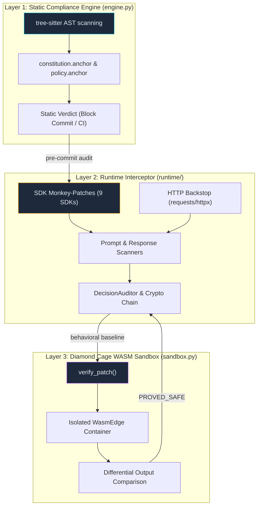

# System Architecture Overview

Anchor is a federated compliance and governance engine for AI integrations. It operates across three distinct execution layers to ensure code safety, runtime enforcement, and behavioral validation of AI outputs.

---

## 🏗️ The Three-Layer Governance Stack

Anchor divides AI governance into three distinct layers, starting from pre-commit static validation to post-execution behavioral proof.

---

## 🔬 Layer 1: Static Compliance Engine

The Static Compliance Engine operates during local development (via pre-commit Git hooks) and within CI/CD pipelines (such as GitHub Actions or GitLab CI).

### How it Works:
1. **Abstract Syntax Tree (AST) Parsing**: Anchor utilizes [Tree-sitter](https://github.com/tree-sitter/tree-sitter) via language-specific adapters (Python, TypeScript, Rust, Go, Java) to parse source code files.
2. **Rule Evaluation**: It evaluates parsed node signatures against the universal `constitution.anchor` and local override rule patterns defined in `policy.anchor`.
3. **Detection Patterns**: It searches for suspicious imports (e.g. raw network connections, unauthorized LLM clients), unmoderated prompts, or unsafe system executions.
4. **Action**: If a blocker or error severity violation is found, the build is rejected.

---

## 🛡️ Layer 2: Runtime Interceptor

The Runtime Interceptor runs inline within the active production environment. It hooks into the AI library layers to dynamically audit inputs and outputs.

### How it Works:
1. **SDK Monkey-Patching**: Anchor uses `wrapt` to intercept function calls across 9 major AI SDK providers:
   * OpenAI, Anthropic, Google Gemini, LangChain, Ollama, Groq, Cohere, Mistral, and HuggingFace.
2. **HTTP Backstop Interceptor**: To prevent developers from bypassing the SDK wraps, a low-level HTTP socket interceptor hooks directly into `requests` and `httpx` transport send sequences, scanning all outbound requests routing to 30+ registered AI API domains.
3. **Inline Prompts & Response Scanners**:
   * **Prompts**: Scans for jailbreaks, prompt injection, and accidental PII leaks before dispatching to the LLM.
   * **Responses**: Scans for secrets leakage, unsafe generated shell/SQL code, or malicious payloads.
4. **Cryptographic Decision Chain**: Every transaction is logged into a tamper-evident, HMAC-signed JSONL ledger where each block depends on the previous block's SHA-256 hash.

---

## 💎 Layer 3: Diamond Cage (WASM Sandbox)

The Diamond Cage provides a secure execution environment to verify patch safety and isolate running models without external network dependencies.

### How it Works:
1. **Process Isolation**: Runs code in a lightweight [WasmEdge](https://wasmedge.org/) container compiling a Python 3.11 / WASI binary.
2. **Resource Constraints**:
   * Complete network isolation (sockets are blocked).
   * Sandbox directory bounds are locked strictly to `/app`.
   * Environment variables are stripped.
   * Execution timeouts are strictly bounded to prevent DoS attacks.
3. **Differential Verification**: Compares the execution output, stdout/stderr, exit codes, and timing profiles of the patched version against the original version.
4. **Verdicts**:
   * `PROVED_SAFE`: Behavioral equivalence verified.
   * `BEHAVIOUR_CHANGED`: Output differs from expected.
   * `MALICIOUS_HALLUCINATION`: Refactored code attempts malicious resource access.

---

## 🌐 The Enterprise Spoke ↔ Hub Mesh

For enterprise environments, Anchor operates a **Sovereign Hub-and-Spoke Mesh** that guarantees absolute data privacy:

* **Local Spoke Node**: Deployed within the company's private cloud (VPC). It receives full decision logs from the local SDK and stores them securely.
* **Master SaaS Hub**: Deployed externally. It only receives lightweight compliance metadata headers (`AUDIT_HEADER`) containing cryptographically signed signatures and compliance verdicts. Raw prompt data never leaves the corporate VPC.
* **Forensic Pull Relay**: If a regulator requests forensic audit details, the SaaS Hub issues a secure request to the Spoke node over a WebSocket connection. The Spoke encrypts the payload locally using AES-256-GCM before transmitting it back.
