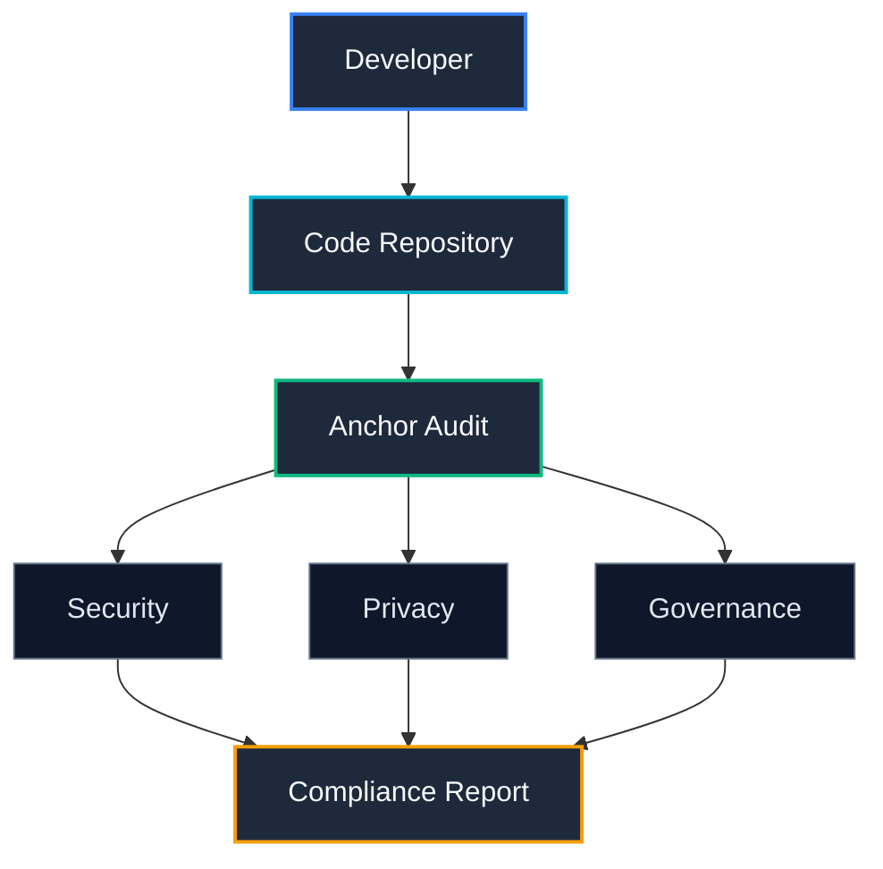

# Anchor Audit

**Governance-as-Code for AI Systems.**

Static compliance scanning, architectural drift detection, and governance enforcement for AI-powered software systems.

---

## Where Anchor Fits



---

### Supported Languages

* **✓ Python** (`.py`)
* **✓ TypeScript / JavaScript** (`.ts`, `.tsx`, `.js`, `.jsx`)
* **✓ Go** (`.go`)
* **✓ Java** (`.java`)
* **✓ Rust** (`.rs`)

---

## Quick Install

```bash
pip install anchor-audit
anchor init --all
anchor check .
```

---

## Getting Started

### 1. Installation
Install the core audit package via pip:
```bash
pip install anchor-audit
```

### 2. Initialize
Fetch the authoritative governance templates (regulators, frameworks, and domains):
```bash
anchor init --all
```
*Or initialize specific subsets matching your compliance posture:*
```bash
anchor init \
    --regulators eu,sec,sebi \
    --frameworks finos,nist \
    --domains security,privacy
```

### 3. Run Scanning
Execute the compliance validation scan on your codebase:
```bash
anchor check .
```

#### Expected CLI Output:
```text
Repository Scan Complete

Files Scanned: 742

Security Violations: 2
Privacy Violations: 1
Governance Violations: 3

Severity:
Blocker: 1
Error: 3
Warning: 2

Report Written:
.anchor/reports/latest.json
```

---

## Documentation Index

Explore the complete system details, integrations, and compliance capabilities:

*   **[Getting Started Guide](file:///d:/Anchor/docs/getting-started.md)** — Step-by-step introduction and setup.
*   **[Installation Details](file:///d:/Anchor/docs/installation.md)** — Environments, sandboxes, and advanced options.
*   **[CLI Reference](file:///d:/Anchor/docs/cli-reference.md)** — Complete command-line manual (`check`, `sync`, `heal`, `init`).
*   **[Core Architecture](file:///d:/Anchor/docs/architecture.md)** — Tree-sitter parsing engine and governance pipeline.
*   **[Supported Rules & Frameworks](file:///d:/Anchor/docs/supported-rules.md)** — Rule matrix mapping to EU AI Act, SEC, and RBI.
*   **[Architectural Drift & Intent Tracking](file:///d:/Anchor/docs/architectural-drift.md)** — Semantic overload detection via Git histories.
*   **[GitHub Actions CI/CD Integration](file:///d:/Anchor/docs/github-actions.md)** — Copy-pasteable workflow setup.
*   **[GitLab CI Configuration](file:///d:/Anchor/docs/gitlab-ci.md)** — GitLab pipeline integration.
*   **[Docker Deployment](file:///d:/Anchor/docs/cli-reference.md#docker-usage)** — Executing scans inside isolated containers.
*   **[SSRN Research Draft Review](file:///d:/Anchor/docs/research/ssrn-paper-review.md)** — Regulatory mapping verification, citations, and JEL classifications.
*   **[Research Q&A Manual](file:///d:/Anchor/docs/research/anchor-paper-qa.md)** — Strategic pilot guide, platform details, and version histories.

### Real-World Integration Examples:
*   **[Python OpenAI Application Audit](file:///d:/Anchor/docs/examples/python-openai-app.md)**
*   **[LangChain Agent Tools Audit](file:///d:/Anchor/docs/examples/langchain-agent.md)**
*   **[Fintech API Compliance](file:///d:/Anchor/docs/examples/fintech-api.md)**

---

## Research & Resources

| Resource | Link / URL |
|---|---|
| **Governance Platform** | [anchorgovernance.tech](https://anchorgovernance.tech) |
| **Technical Preprint (Zenodo)** | [zenodo.org/records/19734724](https://zenodo.org/records/19734724) |
| **SSRN Research Paper** | [ssrn.com/abstract=6933558](https://ssrn.com/abstract=6933558) |
| **Research Institute** | [animuslab.dev](https://www.animuslab.dev) |
| **Anchor Research Program** | [animuslab.dev/programs](https://www.animuslab.dev/programs) |
| **Research Archive** | [animuslab.dev/research](https://www.animuslab.dev/research) |

---
**[AnimusLab](https://www.animuslab.dev)** · *Independent Research Institute* · 2026
