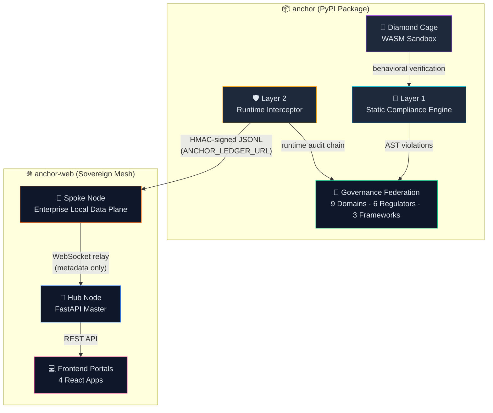
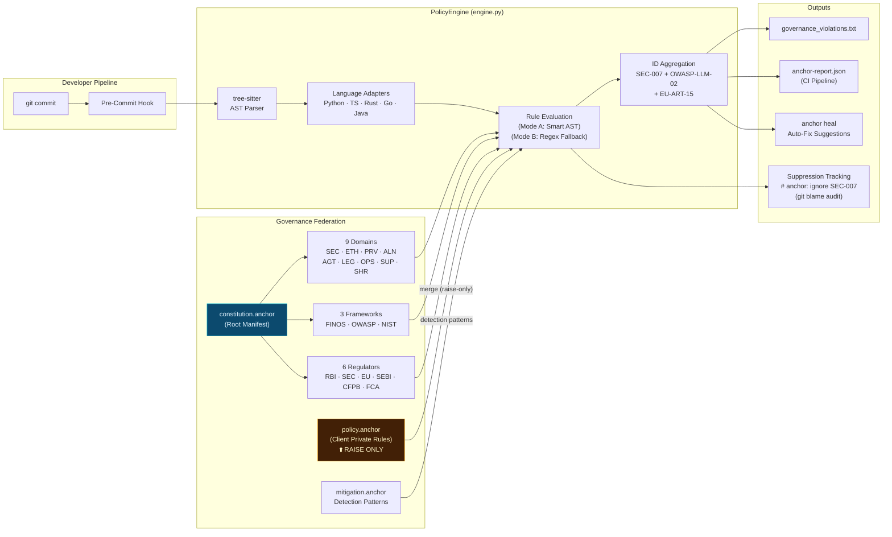
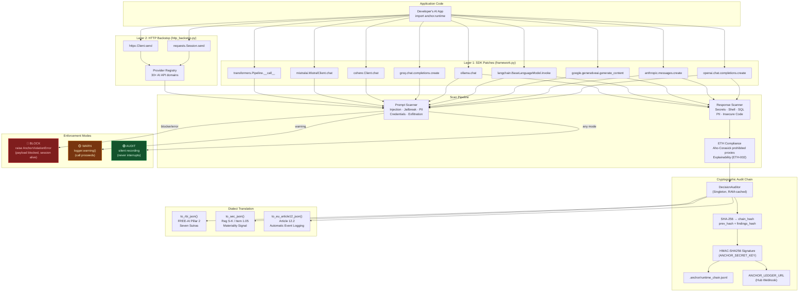
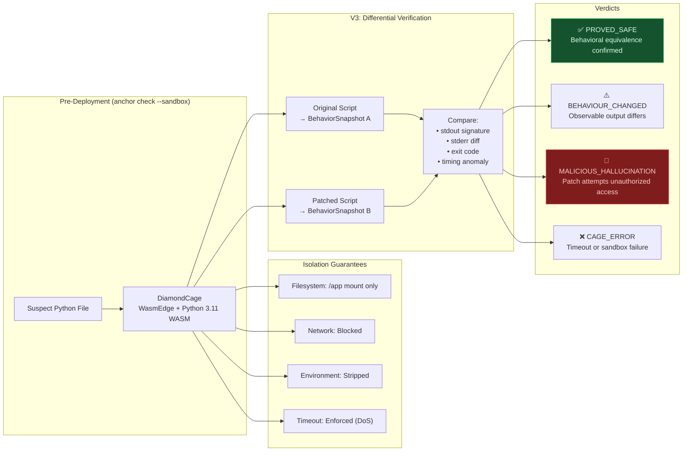
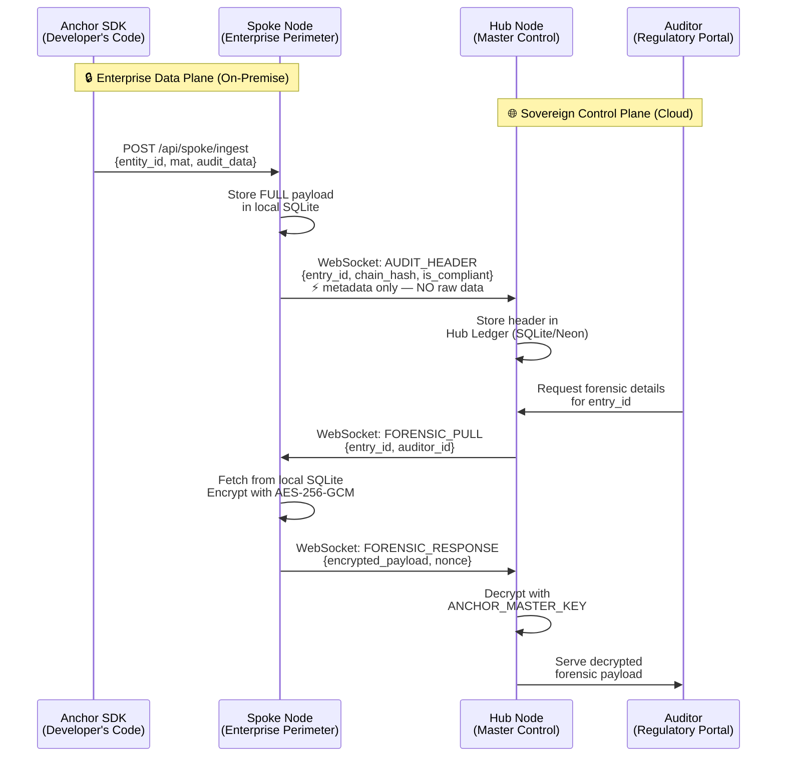
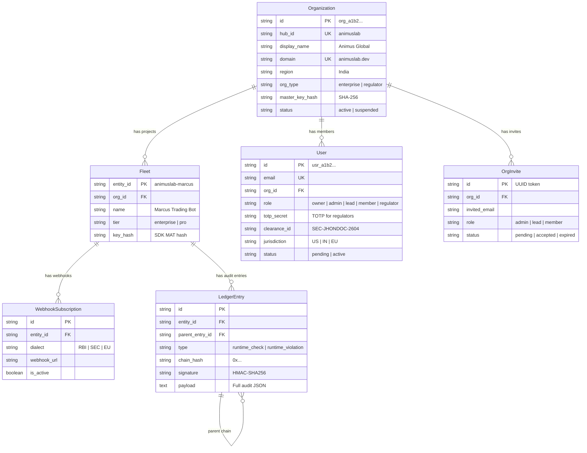
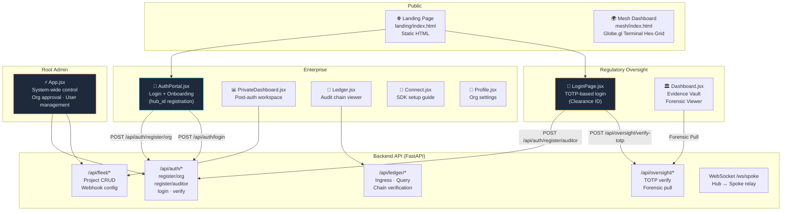
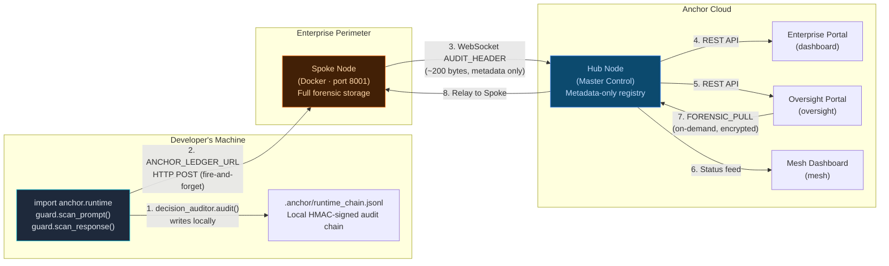

# ANCHOR (v5.0.7)

**The Cryptographic Enforcement Kernel for Agentic AI**

[](https://opensource.org/licenses/Apache-2.0)
[](https://www.python.org/downloads/)
[](https://pypi.org/project/anchor-audit/)
[](https://github.com/AnimusLab/Anchor/releases)
[](https://www.animuslab.dev)

> 📄 Research: "The $3 Billion Warning — Governance Failures in Automated Finance" · SSRN (under review)

> "Probabilistic observation is not governance. Mathematical enforcement is."

Anchor is a federated, two-layer governance engine designed to mathematically seal the behavior of autonomous AI systems. It replaces post-hoc probabilistic classifiers with deterministic structural contracts, ensuring zero "intent drift" in high-frequency, high-stakes financial and operational routing.

This is not a linter. This is the **Decision Audit Chain (DAC)**.

**Research & Institutional Context:** [animuslab.dev](https://www.animuslab.dev) · [Technical Preprint (Zenodo)](https://zenodo.org/records/19734724) · [Anchor Research Program](https://www.animuslab.dev/programs)

---

### I. The Mandate: Zero Intent Drift

As AI models are granted autonomous tool-calling capabilities, the divergence between initial semantic intent ($v_i$) and executed state ($v_e$) creates catastrophic liability. Drift ($D$) is defined as:

$$D = \int_{0}^{t} \mathcal{L}(v_i, v_e) \, dt$$

Anchor is architected to guarantee $D < \epsilon$ through cryptographic enforcement. If an autonomous agent cannot mathematically prove its adherence to the sealed operational constitution, execution is blocked at the kernel level.

#### Why Anchor Exists

| Event | Date | Amount |
|---|---|---|
| Goldman Sachs + Apple CFPB enforcement — AI explainability failure | Oct 2024 | **$89M+** |
| EU AI Act full enforcement begins — credit scoring, AML, fraud | Aug 2026 | Mandatory |
| SEC AI Governance — named #1 examination priority, above crypto | 2026 | Mandatory |
| RBI FREE-AI — 26 mandatory recommendations, per-decision audit trails | Aug 2025 | Mandatory |

---

### II. Main Anchor Architecture

Anchor operates across the complete lifecycle of the intelligence, unified by a single, SHA-256 sealed `constitution.anchor`.

#### 1. System Overview


#### 2. Repository Map

**`anchor`** (Core Governance Engine)
```
anchor/
├── cli.py                    # CLI entry (anchor init / check / heal / sync)
├── schema.py                 # Pydantic AuditEntry schema
│
├── core/                     # ── LAYER 1: Static Compliance ──
│   ├── engine.py             # PolicyEngine — AST scanning + rule evaluation
│   ├── loader.py             # Federation loader (domains + frameworks + regulators)
│   ├── constitution.py       # Remote integrity verification (SHA-256)
│   ├── policy_loader.py      # Local policy.anchor merge (raise-only enforcement)
│   ├── crypto.py             # HMAC-SHA256 chain signing
│   ├── sandbox.py            # 💎 Diamond Cage (WASM sandbox + verify_patch)
│   ├── healer.py             # Auto-fix suggestion engine (anchor heal)
│   ├── verdicts.py           # Architectural drift analysis (Intent Anchoring)
│   ├── model_auditor.py      # ML model weight auditing (safetensors/gguf)
│   └── ...
│
├── runtime/                  # ── LAYER 2: Live Enforcement ──
│   ├── __init__.py           # Public API: activate() / deactivate() / enforce()
│   ├── guard.py              # AnchorGuard — first-party integration API
│   ├── decision_auditor.py   # Cryptographic audit chain + ETH compliance
│   ├── models.py             # AuditEntry with dialect translation (RBI/SEC/EU)
│   └── interceptors/
│       ├── framework.py      # SDK monkey-patches (9 providers via wrapt)
│       ├── http_backstop.py  # Universal HTTP interceptor (requests/httpx)
│       └── ...
│
└── governance/               # ── FEDERATED RULE SYSTEM ──
    ├── constitution.anchor   # Root manifest (v4.1)
    ├── mitigation.anchor     # Detection patterns + fix guidance
    ├── policy.anchor         # Project-local private rules (raise-only)
    ├── domains/ (9)          # SEC·ETH·PRV·ALN·AGT·LEG·OPS·SUP·SHR
    ├── frameworks/ (3)       # FINOS · OWASP · NIST
    └── government/ (6)       # RBI · EU · SEC · SEBI · CFPB · FCA
```

**`anchor-web`** (Sovereign Identity Mesh)
```
anchor-web/
├── server/                   # ── HUB NODE (FastAPI) ──
│   ├── proxy.py              # Main API server (v5.0.0 Master Node)
│   ├── auth.py               # Enterprise auth + registration (hub_id)
│   ├── relay_protocol.py     # Hub ↔ Spoke WebSocket protocol
│   ├── spoke_node.py         # Spoke Node server (enterprise data plane)
│   └── ...
│
├── dashboard/                # ── ENTERPRISE PORTAL (React/Vite) ──
├── oversight/                # ── OVERSIGHT PORTAL (React/Vite) ──
├── root-admin/               # ── ROOT ADMIN PORTAL (React/Vite) ──
├── mesh/                     # ── MESH DASHBOARD (Globe.gl) ──
└── landing/                  # ── PUBLIC LANDING PAGE ──
```

#### 3. Layer 1 — Static Compliance Engine


#### 4. Layer 2 — Runtime Interceptor


#### 5. Diamond Cage — WASM Sandbox


#### 6. Hub ↔ Spoke — Sovereign Relay Protocol


#### 7. Database Schema


#### 8. Frontend Portal Architecture


#### 9. Connection: How `anchor` ↔ `anchor-web` Talk


#### The Data Flow (Numbered)

1. **Local Audit**: `DecisionAuditor.audit()` writes every decision to `.anchor/runtime_chain.jsonl` with HMAC-SHA256 chain linking
2. **Spoke Ingress**: If `ANCHOR_LEDGER_URL` is set, the full payload is HTTP POST'd to the enterprise's local Spoke node
3. **Hub Header**: Spoke pushes a lightweight `AUDIT_HEADER` (~200 bytes) over persistent WebSocket — **no raw data crosses the perimeter**
4. **Enterprise Dashboard**: Enterprise users see their audit chain, fleet status, and compliance scores via REST API
5. **Oversight Dashboard**: Regulators see aggregated compliance metadata and can request forensic details
6. **Mesh Visualization**: The 3D Terminal Mesh globe shows active nodes and relay status
7. **Forensic Pull**: When a regulator needs the raw payload, they trigger a `FORENSIC_PULL` through the Hub
8. **Encrypted Relay**: Hub relays the request to the Spoke, which encrypts the payload with AES-256-GCM and sends it back

---

### III. The Federated Model

Anchor operates on a three-layer constitutional architecture:

| Layer | File | Purpose |
|---|---|---|
| **Constitution** | `constitution.anchor` | Defines **WHAT** risks exist. Domain + framework + regulator manifest. SHA-256 sealed via remote `GOVERNANCE.lock`. |
| **Mitigation Catalog** | `mitigation.anchor` | Defines **HOW** to detect each risk. Regex + AST patterns. Cloud-synced. |
| **State Law** | `policy.anchor` | **Your** local overrides. Change severity, add company-specific rules. |

#### Coverage — V5.0.7

| Tier | Content | Count |
|---|---|---|
| **Domain Rules** | SEC, ETH, PRV, ALN, AGT, LEG, OPS, SUP, SHR | 43 rules |
| **Standards Bodies** | FINOS AI Governance, OWASP LLM Top 10 · 2025, NIST AI RMF 1.0 | 3 frameworks |
| **Government Regulators** | RBI FREE-AI 2025, EU AI Act 2024/1689, SEBI AI/ML 2025, CFPB Reg B, FCA 2024, SEC 2026 | 6 regulators |
| **Total Regulatory Mappings** | | **170+ mappings** |

---

### IV. Key Design Principles

| Principle | Implementation |
|---|---|
| **Constitutional Floor** | `constitution.anchor` defines immutable severity baselines. `policy.anchor` can only RAISE, never lower. |
| **Federated Identity** | Each rule has a canonical ID (e.g. `SEC-007`) that maps through alias chains to FINOS, OWASP, and regulator rules |
| **Data Sovereignty** | Raw forensic data stays on the enterprise's Spoke node. Only cryptographic metadata flows to the Hub. |
| **Audit-Not-Block** | The `@enforce` decorator records violations without interrupting the application. Block mode is opt-in. |
| **Surgical Containment** | `AnchorViolationError` blocks the specific payload but keeps the application session alive. |
| **Zero-Knowledge Proof** | Regulators verify compliance via `chain_hash` + `signature` without needing access to raw prompts/responses. |
| **Multi-Dialect Export** | One `AuditEntry` can be exported as RBI (Sutras), SEC (8-K), or EU AI Act (Article 12) format. |

---

### V. v5.0.7: The Primitive Vocabulary

Version 5 introduces the algorithmic decomposition of regulatory risk. Governance is no longer reliant on vague, hand-authored regex. Every regulatory statute (EU AI Act, FINOS, CFPB, SEC) is algorithmically compiled into five primitive enforcement nodes:

* `[ACTION]` - The operational vector.
* `[OBJECT]` - The target entity.
* `[CONTEXT]` - The environmental state.
* `[AUTHORITY]` - The cryptographic signature requirement.
* `[FLOW]` - The data trajectory.

---

### VI. The Anchor Healer: Autonomous Remediation

Beyond detection, Anchor v5 introduces the **Healer** node. When a violation is detected in the AST or runtime stream, Anchor generates a mathematically verified patch (MVP) that restricts the execution path without breaking functionality. This patch is then validated inside the **Diamond Cage** before deployment.

---

### VII. Cryptographic Integrity (`GOVERNANCE.lock`)

Anchor enforces a strict "Governance Floor Invariant."

The `GOVERNANCE.lock` mechanism seals all 18 active policy and domain files (SEC, ETH, PRV, ALN, AGT) via SHA-256. Any local modification to the ruleset by an unauthorized developer produces an immediate hash mismatch and deployment failure.

You cannot silently weaken the law.

---

### VIII. Execution

**Initialization & Sealing:**

```bash
anchor init --strict
anchor seal --target ./domains
```

**Runtime Enforcement Declaration:**

```python
from anchor import enforce

@enforce(mode="structured", jurisdiction="SEC_FINOS", required_primitives=["AUTHORITY", "FLOW"])
def route_institutional_capital(agent_intent, market_data):
    # AnchorRuntime intercepts, hashes, verifies against constitution, 
    # and appends to the HMAC-signed Decision Audit Chain (DAC) before execution.
    return core_llm.execute(agent_intent, market_data)
```

---

### IX. CI/CD Integration

Anchor acts as the enforcement gate in GitHub Actions. If a PR violates the constitution, Anchor blocks the merge with a detailed violation report.

```yaml
# .github/workflows/anchor-audit.yml
- name: Run Governance Check
  run: |
    pip install anchor-audit
    anchor check --dir ./src --severity error --json-report --github-summary
```

---

### X. Suppressing Findings

When a finding is a justified use (e.g., your governance tool legitimately needs `subprocess`), suppress it with an inline comment:

```python
# Per-rule suppression
result = subprocess.run(cmd, capture_output=True)  # anchor: ignore ANC-018

# Suppress all rules on a line
os.environ.get("SECRET_KEY")  # anchor: ignore-all
```

| Feature | Details |
|---|---|
| **Scope** | Line-level only |
| **Audit Trail** | Anchor uses `git blame` to record who authorized each suppression |
| **Visibility** | Suppressed findings appear in the report with the author's name |

---

### XI. Security Architecture — SHA-256 Tamper Proofing

```
┌─────────────────────────────────────────────────┐
│  GitHub Raw (Source of Truth)                    │
│  constitution.anchor  →  SHA-256: 3745014B...   │
│  mitigation.anchor    →  SHA-256: E3E32531...   │
└────────────────┬────────────────────────────────┘
                 │ fetch + verify
┌────────────────▼────────────────────────────────┐
│  .anchor/cache/ (Local)                         │
│  Hash mismatch → INTEGRITY VIOLATION            │
│  Hash match    → Proceed with audit             │
└─────────────────────────────────────────────────┘
```

---

### XII. Links

| Resource | URL |
|---|---|
| **PyPI Package** | [pypi.org/project/anchor-audit](https://pypi.org/project/anchor-audit/) |
| **Technical Preprint (Zenodo)** | [zenodo.org/records/19734724](https://zenodo.org/records/19734724) |
| **SSRN Research Paper** | [ssrn.com/abstract=6933558](https://ssrn.com/abstract=6933558) |
| **Research Institute** | [animuslab.dev](https://www.animuslab.dev) |
| **Anchor Research Program** | [animuslab.dev/programs](https://www.animuslab.dev/programs) |
| **Research Archive** | [animuslab.dev/research](https://www.animuslab.dev/research) |
| **Governance Platform** | [anchorgovernance.tech](https://anchorgovernance.tech) |
| **GitHub Organization** | [github.com/AnimusLab](https://github.com/AnimusLab) |

---

**[AnimusLab](https://www.animuslab.dev)** · *Independent Research Institute* · *Governable Intelligence* · 2026
