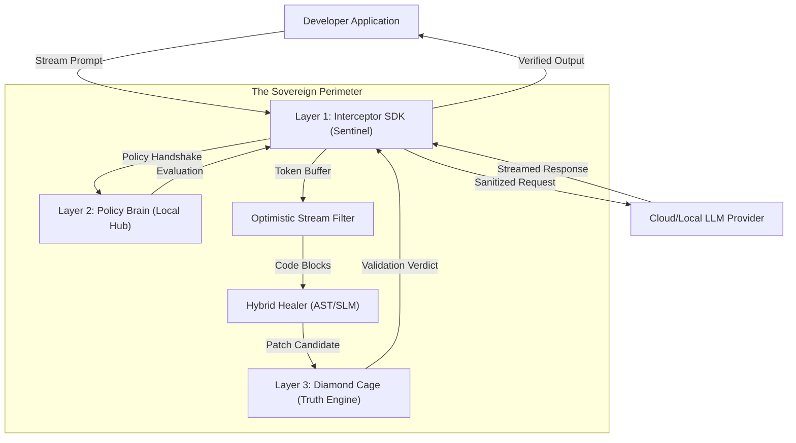

# Anchor v3 Technical Roadmap: "The Sovereign Scalpel" 🛡️⚡🚀

**Version**: 3.0.0-Official-Spec
**Phase**: Hyper-Rollout (90 Days)
**Target**: Enterprise AI Governance (FINOS / OpenJS / Global Banking)

---

## 🏗️ 1. The Executive Thesis: Why Anchor v3?

The current state of AI governance is a "Blunt Instrument." Organizations either block AI entirely (stifling innovation) or allow it with generic cloud-only wrappers that are expensive, laggy, and prone to "hallucinations."

Anchor v3 introduces **"Deterministic Sovereignty."** We believe that the only way to govern AI in high-stakes environments like Global Banking is to move governance from the _Cloud_ to the _Code_, and from _Probabilistic Guessing_ to _Symbolic Proof_.

### **1.1 The Architecture of the Perimeter**

Anchor v3 operates as a resident process. It is no longer a tool you "run"; it is the environment you "inhabit." It sits at the junction of the **Developer Prompt** and the **LLM Response**, providing a zero-trust gateway for data flowing in both directions.



---

## 📁 2. Layer 1: The Interceptor SDK (Resident Governance)

The Interceptor is an "In-Process Sentinel." In traditional systems, security is an afterthought. In v3, the Interceptor ensures that **Security is the Interface.**

### **2.1 Behavioral Wrapping (The Sentinel)**

Instead of requiring developers to manually integrate validation calls, the Interceptor uses **Behavioral Wrapping**. This means it intercepts calls to standard libraries (`openai`, `anthropic`, `langchain`) at the runtime level.

#### **Python Implementation (wrapt)**

We utilize `wrapt` for transparent decorators. Unlike standard decorators, `wrapt` maintains the original function's signature and docstrings. This is critical for enterprise developers who rely on IDE type-hinting and documentation.

```python
# anchor/runtime/interceptors/openai_wrapper.py
import wrapt
import time
from anchor.core.engine import AnchorEngine

@wrapt.patch_function_wrapper('openai.resources.chat.completions', 'Completions.create')
def wrapped_create(wrapped, instance, args, kwargs):
    """
    Transparently intercepts OpenAI ChatCompletion calls.
    """
    engine = AnchorEngine.get_instance()

    # Contextual awareness: Know who is asking and why.
    context = {
        "user": get_iam_user(),
        "project": "trading-platform-v4",
        "risk_tolerance": "HARD_BLOCK",
        "timestamp": time.time()
    }

    # Prompt Interception: Prevent data exfiltration before it leaves the VPC.
    messages = kwargs.get('messages', [])
    for msg in messages:
        # We don't just search for keywords; we scan for PII and IP patterns.
        analysis = engine.scan_prompt(msg['content'], context)
        if analysis.is_violated:
            # Audit first, then block.
            log_violation(analysis, context)
            raise AnchorViolationError(f"Security Block: {analysis.rule_id}")

    # Pass-through to the original LLM, but wrapped in a scanning buffer.
    response = wrapped(*args, **kwargs)
    return AnchorStreamWrapper(response, context)
```

### **2.2 Java Implementation (Bytecode Instrumentation)**

For the JVM, we move deeper. Anchor uses **ByteBuddy** to intercept the `com.openai.client` or `langchain4j` binaries at the bytecode level during class loading. This ensures that even if a developer tries to bypass our SDK, the governance layer is already baked into the memory.

```java
// anchor-java-agent/src/main/java/anchor/Interceptor.java
// Intercepting at the source: No library is safe from sovereignty.
new AgentBuilder.Default()
    .type(named("com.openai.client.ChatService"))
    .transform((builder, type, loader, module) ->
        builder.method(named("createCompletion"))
               .intercept(MethodDelegation.to(AnchorGovernanceInterceptor.class))
    ).installOn(instrumentation);
```

### **2.3 The Web SDK (JavaScript/TypeScript)**

On the frontend, we utilize the **Proxy Pattern**. By wrapping the `fetch` API or the SDK instance, we can enforce CISO-level rules on web-based AI tools.

```javascript
// anchor-sdk/interceptor.js
const anchorInterceptor = {
  apply: function (target, thisArg, argumentsList) {
    const prompt = argumentsList[0].messages.map((m) => m.content).join(" ");

    // Low-Latency policy check
    if (AnchorPolicy.isViolated(prompt)) {
      AnchorTelemetry.emit("PROMPT_BLOCK", {
        preview: prompt.substring(0, 100),
      });
      return Promise.reject(
        new Error("[Anchor] CISO Block: Unsafe Prompt Detected"),
      );
    }

    return target.apply(thisArg, argumentsList).then((response) => {
      // Wrap the response for token-level scanning
      return new AnchorResponseProxy(response);
    });
  },
};
```

---

## 🛠️ 3. The Hybrid Healer: Autonomous Recovery

The "Hybrid Healer" is Anchor's response to the **Productivity Paradox**. Security is no longer a blocker; it is a feature that completes the work for you.

### **3.1 Tier 1: Deterministic AST Patching (Symbolic Proof)**

For 80% of security violations, we do not use AI. We use **Symbolic Logic.** This is 100% accurate, requires no internet connection, and costs nothing.

**The "How"**:
Anchor uses Tree-Sitter to identify the exact AST (Abstract Syntax Tree) node of a violation. It then applies a **Refactoring Template** that is mathematically proven to be secure.

#### **Rule Example: SQL Injection (Java)**

- **Vulnerable**: `stmt.executeQuery("SELECT * FROM users WHERE id = " + id);`
- **Healed**: `PreparedStatement ps = conn.prepareStatement("SELECT * FROM users WHERE id = ?"); ps.setString(1, id); ps.executeQuery();`

```python
# anchor/healer/tier1/java/sql_injection.py
import tree_sitter_java as tsjava
from tree_sitter import Language, Parser

JAVA_LANGUAGE = Language(tsjava.language())
parser = Parser(JAVA_LANGUAGE)

# Query to find concatenated SQL strings in Java.
SQL_QUERY = JAVA_LANGUAGE.query("""
(method_invocation
  name: (identifier) @name (#eq? @name "executeQuery")
  arguments: (argument_list (binary_expression left: (string) right: (identifier))))
""")

def apply_fix(source_code):
    # This is a symbolic transformation, not an AI guess.
    # It is instant and hallucination-free.
    return transform_to_prepared_statement(source_code)
```

---

## ⚖️ 4. Layer 3: The Truth Engine (The Diamond Cage)

The biggest problem with AI-generated fixes is **hallucination.** Even a deterministic patch might break the application's unique logic. Anchor v3 solves this using **Differential Behavioral Verification.**

### **4.1 Behavioral Verification (The WASM Proof)**

We believe that a "Secure Fix" that breaks the code is a "Bug." Using the Diamond Cage (WASM), we perform a side-by-side run:

1.  **Original (Failing Security)**: Behavior recorded (Syscalls, memory, stdout).
2.  **Patched (Secure)**: Behavior compared.
3.  **The Verdict**: If `Output(Fixed) == Output(Original)` but the security violation is gone, the fix is **Proved Safe.**

### **4.2 Syscall Containment**

The cage doesn't just check text; it checks impact. If a fix for a Python script suddenly tries to access `/etc/passwd` when the original didn't, the Diamond Cage flags it as **Malicious Hallucination** and discards the patch.

---

## ⚡ 5. Optimistic Stream Filtering (Zero-Lag UX)

In the enterprise, if a security tool adds more than 100ms of latency, developers will find a way to disable it. Anchor v3 uses **"Optimistic Buffering."**

- **The Problem**: Waiting for an LLM to finish 500 tokens before scanning adds 2-5 seconds of delay.
- **The Solution**: Anchor allows tokens to stream directly to the user. Behind the scenes, we maintain a **12-token sliding window.**
- **The Kill Switch**: If the window matches a "Critical Danger" pattern (like the start of a `chmod` command on a sensitive file), the Interceptor kills the stream instantly. The user sees a "Censor Beep" (`[BLOCK: Security Violation]`) rather than a full page of malicious code.

---

## 🍰 6. The "Layer Cake" Policy: Organizational Harmony

Large banks struggle with **Rigid Centralization.** A global policy that works for the Mobile Team might break the High-Frequency Trading Team. Anchor's 3-layer merge solves this:

1.  **Global (CISO Hub)**: Rules that are non-negotiable. e.g., "No API keys in logs."
2.  **Team (Department)**: Rules specific to the domain. e.g., "Retail Banking must block PII."
3.  **Local (Repo)**: Project-level specificity. e.g., "Ignore the mock-data folder."

**The Result**: The Trading Team can have low-latency rules while the Customer Service team has high-security filters—all governed by the same central hub.

---

## 🏦 7. Bring Your Own Key (BYOK): Data Sovereignty

Anchor v3 is designed to never "see" a bank's code. We provide a **Modular Provider Adapter** that ensures data never leaves the bank's perimeter.

- **Sovereignty**: Your keys stay in your Key Vault (Azure KV, AWS Secrets Manager).
- **Execution**: Anchor is deployed as a sidecar or a library inside the bank's VPC.
- **Direct Routing**: Data flows directly from your VPC to your private Azure/AWS AI instance. Anchor is the **Guard**, not the **Gateway.**

---

## 🎨 8. Feature Deep-Dive: The Security Rule Gallery

To provide context, here are the "How-To" implementation details for Anchor's most aggressive security rules.

| Rule ID         | Language | Violation Pattern           | Deterministic Fix              |
| --------------- | -------- | --------------------------- | ------------------------------ |
| **SEC-PY-ENV**  | Python   | `os.environ.get("SECRET")`  | Swap to `vault.get_secret()`   |
| **SEC-JS-SQL**  | JS/TS    | Template Literal SQL        | Parameterized Query Injection  |
| **SEC-JAVA-SO** | Java     | `Runtime.exec()`            | ProcessBuilder with Array Args |
| **SEC-GO-PATH** | Go       | `filepath.Join(user_input)` | Path Sanitization Wrapper      |

### **The "How" (Implementation Detail)**

Every rule is backed by a **Forensic Analysis Module**. If Anchor blocks a prompt, it doesn't just say "No." It generates a **Violation Dossier** that includes:

- The exact token that triggered the block.
- The CISO rule that was violated.
- The legal/compliance justification (e.g., GDPR Article 32).

---

## ⏳ 9. Scaling to 30+ Languages: The Adapter Factory

The v3 "Turbo-Charged" roadmap focuses on velocity. We have standardized the **Language Lifecycle** into a repeatable 16-hour sprint.

### **The 16-Hour Language Sprint**

1.  **H1-4 (AST Bridge)**: Map `tree-sitter-<lang>` grammar nodes to Anchor universal primitives.
2.  **H5-8 (Symbolic Engine)**: Draft 10 deterministic refactoring templates for the Top 5 risks in that language.
3.  **H9-12 (WASM Porting)**: Compile a minimal WASI runtime (e.g., `python.wasm`, `go.wasm`) for the Diamond Cage.
4.  **H13-16 (Verification)**: Build the "Differential Baseline" test suite to ensure stable verification.

---

## 🚀 10. The Final Goal: A Sovereign Ecosystem

Anchor v3 is the **Universal Constitution for AI.**

- **Economic Impact**: Organizations save millions in token costs and security incident remediation by using Local SLMs and Deterministic Patching.
- **Political Impact**: Anchor provides a "Safe Neutral Zone" where developers and Security Teams can collaborate instead of conflict.
- **Technical Impact**: We prove that governance can be faster than the problem it solves.

---

> [!IMPORTANT]
> **Conclusion**: Anchor v3 is the **Sovereign Scalpel**. It is built for a world where AI is everywhere, but risk is no longer anonymous. We deliver deterministic, zero-cost, and verified safety for the enterprise. ⚓⚖️🚀

---

_Anchor v3 Technical Bible | Prepared by Tanishq1030_
