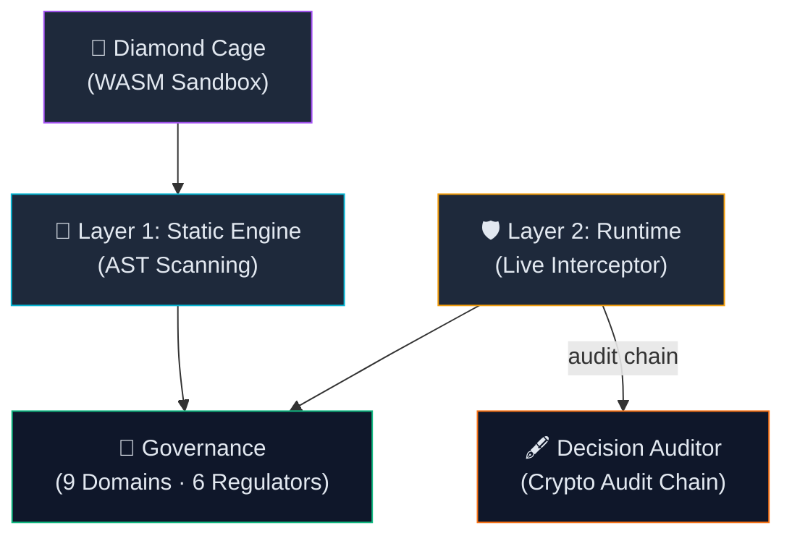
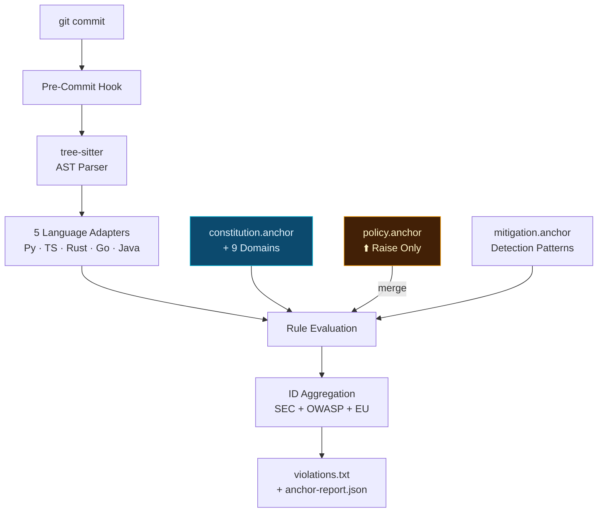
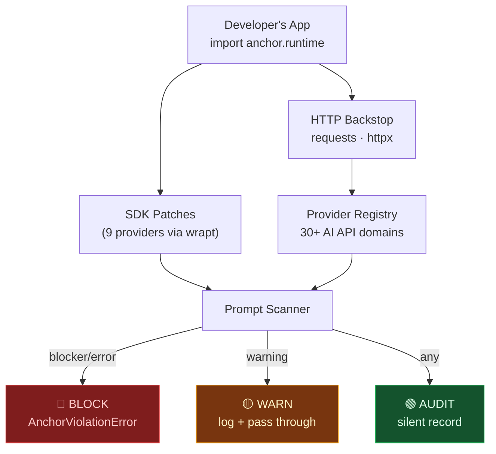
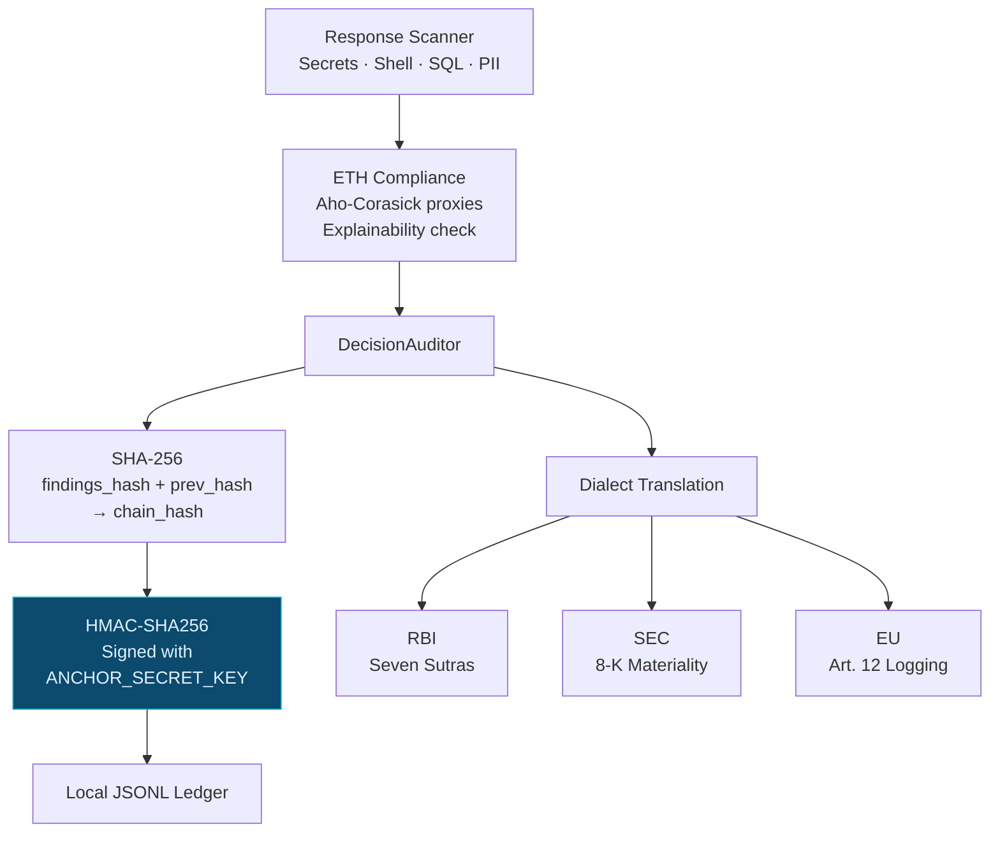
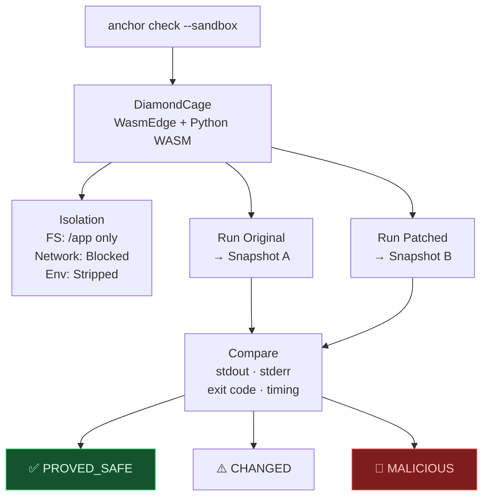

# Anchor — System Architecture (Kernel v5.0.2)

> **`anchor`** = The Cryptographic Enforcement Kernel for Agentic AI

---

## 01. System Overview



---

## 02. Repo Structure: `anchor` (Core Kernel)

```
anchor/
├── cli.py                       # anchor init / check / heal / sync
├── core/
│   ├── engine.py                # PolicyEngine (AST + regex scan)
│   ├── loader.py                # Federation loader
│   ├── constitution.py          # Remote SHA-256 integrity
│   ├── crypto.py                # HMAC-SHA256 signing
│   ├── sandbox.py               # Diamond Cage (WASM)
│   ├── healer.py                # Auto-fix suggestions
│   ├── verdicts.py              # Architectural drift
│   ├── model_auditor.py         # ML weight auditing
│   └── policy_loader.py         # policy.anchor merge
├── runtime/
│   ├── __init__.py              # activate() / enforce()
│   ├── guard.py                 # AnchorGuard API
│   ├── decision_auditor.py      # Crypto audit chain
│   ├── models.py                # AuditEntry (RBI/SEC/EU dialects)
│   └── interceptors/
│       ├── framework.py         # 9 SDK patches (wrapt)
│       ├── http_backstop.py     # requests/httpx catch-all
│       ├── output_scanner.py    # Response scanner
│       └── provider_registry.py # 30+ AI API domains
├── adapters/                    # tree-sitter (Py/TS/Rust/Go/Java)
├── plugins/                     # safetensors / gguf / huggingface
└── governance/
    ├── constitution.anchor      # Root manifest
    ├── mitigation.anchor        # Detection patterns
    ├── domains/ (9)             # SEC·ETH·PRV·ALN·AGT·LEG·OPS·SUP·SHR
    ├── frameworks/ (3)          # FINOS · OWASP · NIST
    └── government/ (6)          # RBI · EU · SEC · SEBI · CFPB · FCA
```

---

## 03. Layer 1 — Static Engine



> [!NOTE]
> **`policy.anchor`** lets each client add private rules and raise severity thresholds — but can **never lower** the constitutional floor. The governance baseline is absolute. (`enforce_raise_only: true`)

---

## 04. Layer 2 — SDK Interception



**Patched SDKs:** OpenAI · Anthropic · Google Gemini · LangChain · Ollama · Groq · Cohere · Mistral · HuggingFace

> [!IMPORTANT]
> **BLOCK does NOT kill the session.** It raises a catchable `AnchorViolationError` — blocks the specific payload but keeps the application alive. The developer catches the exception and substitutes a safe response.

---

## 05. Layer 2 — Audit Chain (DAC)



---

## 06. Diamond Cage (WASM Sandbox)



---

## Key Principles

| Principle | How |
|---|---|
| **Constitutional Floor** | `policy.anchor` can only RAISE severity, never lower |
| **Federated ID** | SEC-007 → OWASP-LLM-02 → EU-ART-15 via alias chains |
| **Surgical Containment** | `AnchorViolationError` blocks payload, keeps session alive |
| **Multi-Dialect** | One AuditEntry → RBI Sutras / SEC 8-K / EU Art.12 |
| **Zero Intent Drift** | Mathematical enforcement of initial intent via cryptographic sealing |

---

**AnimusLab** // *System Witness* // 2026
