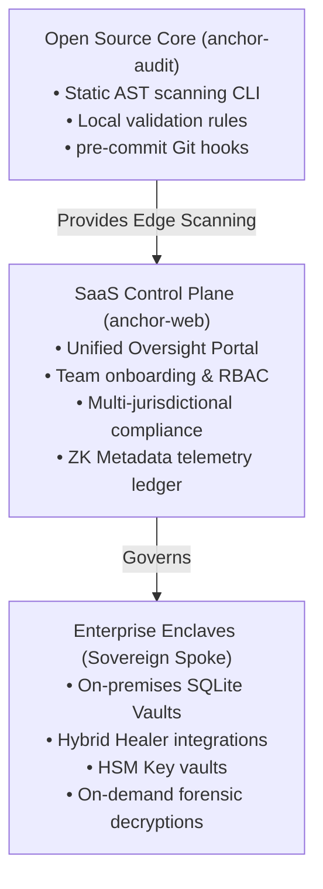
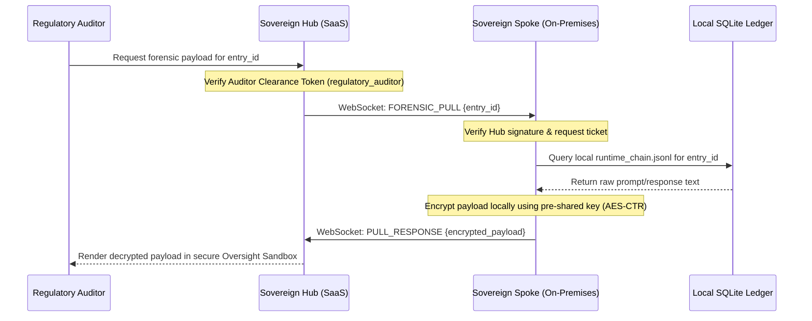

# Anchor Web Portal: Commercial Model & Data Isolation

This document outlines the business model, hub-and-spoke isolation model, and cryptographic data flow that guarantees security and compliance in the Anchor ecosystem.

---

## 1. Commercial Model: Open Core & SaaS Oversight

Anchor operates on an **Open Core** business model designed to balance open-source adoption with enterprise-grade regulatory control:

### Commercial Tiers

#### A. The Open Source Core (Free / MIT License)
*   **Target**: Individual developers, startups, and open-source projects.
*   **Features**: CLI checks (`anchor check`), basic rulesets, pre-commit validation hook, and local audit ledgers (`runtime_chain.jsonl`).

#### B. The Unified Oversight SaaS (`oversight.anchorgovernance.tech`)
*   **Target**: Compliance teams, financial institutions, and government regulators.
*   **Model**: Subscription based (per-seat / per-agent-scan).
*   **Features**: Web portal dashboards, regulatory mapping visualization, compliance heatmap generation, automated notice dispatch, and JWT capability gates.

#### C. Sovereign Spoke Enclave (Enterprise License)
*   **Target**: Tier-1 banks, asset managers, and health-tech enterprises.
*   **Model**: Annual license ($50K - $200K+ based on seat count and volume).
*   **Features**: Dedicated on-premise hub deployment, integration with HSMs (AWS Secrets Manager, Azure Key Vault), and the **Sovereign Relay** WebSocket framework to guarantee complete data isolation.

---

## 2. Data Isolation & The Codebase Boundary

A major barrier to AI compliance is **intellectual property protection**. Companies refuse to deploy tools that upload their proprietary source code or private customer prompt logs to third-party databases.

Anchor enforces a strict **Zero-Knowledge Metadata Plane** to guarantee data isolation:

### Why Auditors Cannot See Codebases
1.  **Static Isolation**: The `anchor check` CLI runs entirely on the developer's machine or inside the company's local build environment. It parses source files, compares structures, and outputs findings locally.
2.  **Telemetry Isolation**: Spoke nodes (running in the company's private cloud) only transmit **ZK Metadata Headers** to the external SaaS Oversight Hub.
    *   *Transmitted*: Violating rule IDs, compliance verdicts, execution timestamps, and cryptographic block signatures.
    *   *Isolated (Never Leaves the VPC)*: Raw source code files, specific variables, databases, and prompt/response text logs.
3.  **The Codebase Exclusion rule**: As validated by `EntityVisibilityFilter`, all auditor roles (Standard, Cross-Hub, and Regulatory) are programmatically blocked from listing, accessing, or reading entities classified as `CODEBASE` or `DATABASE`.

---

## 3. Cryptographic Forensic Pull (WebSocket Workflow)

In the event of a critical compliance failure, a regulatory auditor (e.g., RBI or SEC inspector) may require access to the raw prompt/response payload that triggered the violation. 

Instead of maintaining a central database of raw logs, Anchor uses an **On-Demand Forensic Pull** via a persistent WebSocket relay protocol:

### Encryption & Zero-Dependency Security
To run in highly restricted environments without external dependencies, the Spoke client handles encryption using a lightweight, built-in cryptosystem:
1.  **Block Cipher**: XORs the payload block-by-block with SHA-256 digests in Counter (CTR) mode.
2.  **Preshared Key**: Uses the enterprise's local `ANCHOR_SECRET_KEY` (or `ANCHOR_MAT`) stored in their secure vault.
3.  **Auditor Decryption**: The master hub decrypts and displays the payload within a sandbox frame, ensuring the data is parsed only under authorized compliance contexts.
